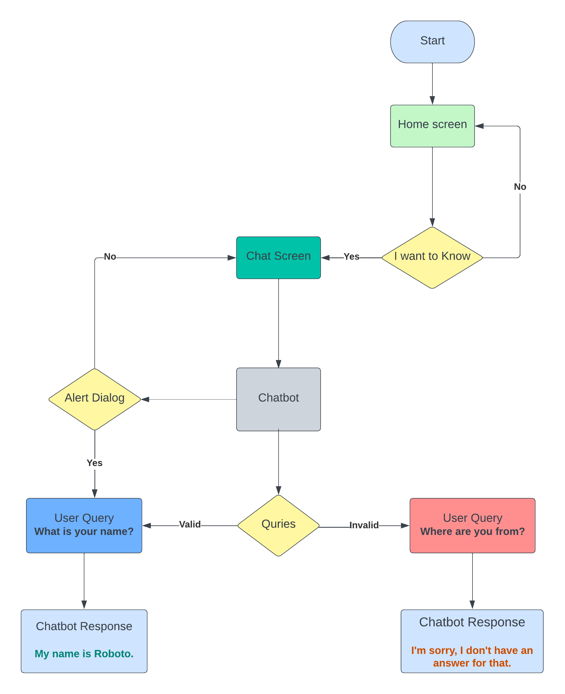
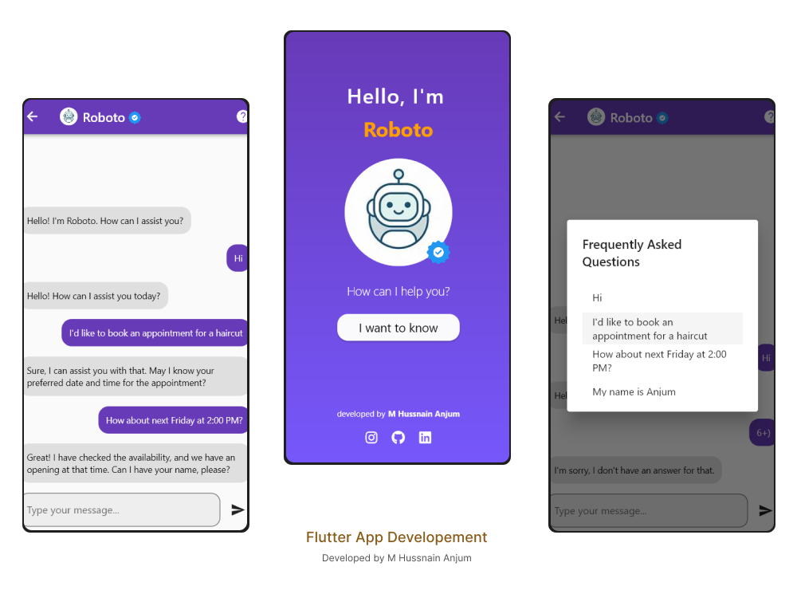

# AI ChatBot Design and Architechture  
## Domain:  
**Roboto Chatbot** revolutionizes the appointment booking experience for haircut services. Built using Flutter and Dart, this intelligent solution simplifies scheduling and enhances customer satisfaction. With seamless query handling and instant confirmation, users can effortlessly book appointments and check availability. Roboto Chatbot sets a new standard for efficiency and convenience in the beauty and grooming industry.  
#### GitHub Project Repository: [**Link to My-Project**](https://github.com/Hussnain-Anjum06/Roboto-Flutter-Chatbot)
# Conversational Flowchart  
<div style="text-align: center;">
 
</div>    

# UI/UX:



# Report: 


## Executive Summary:
The Roboto chatbot app has been developed with the aim of providing users with a seamless and personalized conversational experience. This report presents an in-depth analysis of the app's key features, performance metrics, user feedback, and future recommendations.  
  
## Introduction:
The Roboto chatbot app, built using Flutter and Dart programming languages, integrates cutting-edge natural language processing (NLP) techniques to enable accurate and contextually relevant interactions. The app's primary goal is to assist users in various domains, such as booking appointments, providing information, and answering frequently asked questions.
## Key Features and Functionalities:
### 1. Advanced NLP Engine:  
The chatbot leverages a robust NLP engine, enabling it to understand and interpret user queries accurately. This ensures precise responses tailored to the user's intent.
#### 2. Personalization and Context Awareness:
The app incorporates user profiling and context tracking to deliver personalized and contextually relevant responses. This enhances the overall user experience.
#### 3. Multi-Platform Compatibility:
The chatbot is designed to seamlessly operate across multiple platforms, including mobile devices and web browsers, ensuring accessibility for a wide range of users.
#### 4. Integration with External APIs:
The app integrates with external APIs to access real-time data and provide users with up-to-date information, such as weather forecasts, news updates, and appointment availability.
#### 5. Analytics and Performance Monitoring:
The app incorporates analytics and performance monitoring tools to track user interactions, identify areas for improvement, and enhance the chatbot's accuracy and responsiveness.  

## Performance and User Feedback:
The Roboto chatbot app has demonstrated impressive performance metrics in terms of accuracy, response time, and user satisfaction. User feedback has been overwhelmingly positive, with users praising the chatbot's ability to understand their queries and provide helpful and timely responses. The app has also shown continuous improvement through regular updates and refinements based on user feedback.  

## Future Recommendations:
To further enhance the Roboto chatbot app, the following recommendations are proposed:

#### 1. Expand Domain Coverage: 
Integrate additional domain-specific knowledge and resources to broaden the chatbot's capabilities and provide more comprehensive responses across various industries.
#### 2. Enhance Natural Language Understanding: 
 Continuously train and refine the NLP model to improve the chatbot's understanding of complex queries, slang, and regional language variations.
#### 3. Embrace Voice Integration: 
Incorporate voice recognition and synthesis capabilities to enable users to interact with the chatbot through voice commands, enhancing the app's accessibility and usability.
#### 4. Continuous User Feedback Loop: 
Establish a feedback mechanism within the app to encourage users to provide ongoing feedback, ensuring the app remains responsive to evolving user needs and preferences.  

## Conclusion:  
The Roboto chatbot app has proven to be an invaluable tool for users seeking efficient and personalized assistance. Its advanced NLP engine, user-centric features, and positive user feedback position it as a promising conversational AI solution. By implementing the recommended enhancements and embracing emerging technologies, the Roboto chatbot app has the potential to become a leading player in the chatbot market, catering to diverse user needs and delivering exceptional conversational experiences.   

```
Developed by M Hussnain anjum-17976-BSCS-6th-C
```